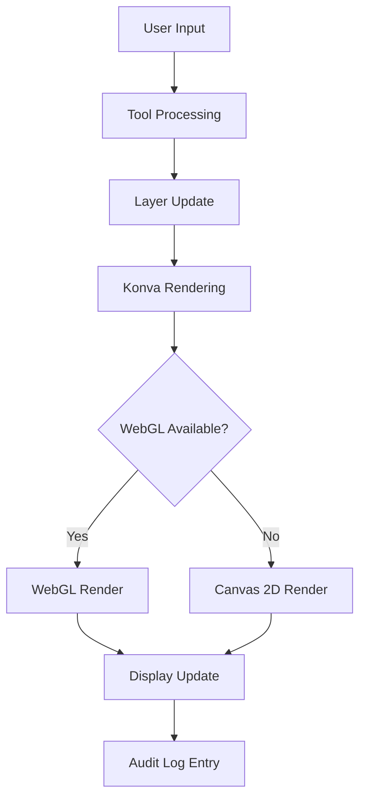

# Design Document

## Overview

This design document outlines the architecture for an advanced photo editing application built with Next.js, featuring HIPAA-compliant audit logging, professional editing tools, and complete local processing. The application combines the power of Konva.js for canvas manipulation with shadcn/ui components and Tailwind CSS for a polished user interface, all while ensuring no data leaves the user's browser.

### Key Design Principles

- **Local-First Architecture**: All processing occurs client-side with no server dependencies
- **Layer-Based Editing**: Photoshop-inspired non-destructive editing workflow
- **Performance-Optimized**: WebGL acceleration with Canvas 2D fallback
- **HIPAA Compliance**: Comprehensive audit logging for healthcare use cases
- **Professional Tools**: Industry-standard editing capabilities
- **Privacy-Focused**: Built-in censoring tools for sensitive content

## Architecture

### High-Level System Architecture

```
┌─────────────────────────────────────────────────────────────┐
│                    Browser Environment                       │
├─────────────────────────────────────────────────────────────┤
│  ┌─────────────────┐  ┌─────────────────┐  ┌─────────────────┐ │
│  │   UI Layer      │  │  Canvas Layer   │  │  Storage Layer  │ │
│  │                 │  │                 │  │                 │ │
│  │ • shadcn/ui     │  │ • Konva.js      │  │ • IndexedDB     │ │
│  │ • Tailwind CSS  │  │ • WebGL/Canvas  │  │ • localStorage  │ │
│  │ • React State   │  │ • Layer System  │  │ • Session Data  │ │
│  └─────────────────┘  └─────────────────┘  └─────────────────┘ │
│                                                                │
│  ┌─────────────────┐  ┌─────────────────┐  ┌─────────────────┐ │
│  │  Tool System    │  │  Audit System   │  │  Export System  │ │
│  │                 │  │                 │  │                 │ │
│  │ • Brush Engine  │  │ • Event Logger  │  │ • Image Flatten │ │
│  │ • Adjustments   │  │ • HIPAA Reports │  │ • Format Export │ │
│  │ • Censoring     │  │ • Session Track │  │ • Preview Gen   │ │
│  └─────────────────┘  └─────────────────┘  └─────────────────┘ │
└─────────────────────────────────────────────────────────────────┘
```

### Technology Stack

- **Framework**: Next.js 14+ with TypeScript
- **Canvas Library**: Konva.js 9.0+ with react-konva
- **UI Framework**: shadcn/ui components
- **Styling**: Tailwind CSS 4.1 (CLI-based, not PostCSS)
- **Icons**: Material Symbols Rounded (variable font)
- **Typography**: Roboto Variable Font (100-900 weights)
- **State Management**: Zustand for complex application state
- **Storage**: IndexedDB for large data, localStorage for preferences
- **Performance**: Web Workers for heavy processing, WebGL acceleration

## Components and Interfaces

### Core Application Structure

```typescript
// Main application layout
interface EditorLayout {
  menuBar: MenuBarComponent;
  toolPalette: ToolPaletteComponent;
  canvasArea: CanvasAreaComponent;
  layersPanel: LayersPanelComponent;
  propertiesPanel: PropertiesPanelComponent;
  historyPanel: HistoryPanelComponent;
  statusBar: StatusBarComponent;
}

// Canvas system built on Konva.js
interface CanvasSystem {
  stage: Konva.Stage;
  layers: LayerManager;
  tools: ToolManager;
  viewport: ViewportController;
  selection: SelectionManager;
}
```

### Layer System Architecture

The layer system is the core of the editing experience, built on Konva.js layers:

```typescript
interface LayerManager {
  baseLayer: BaseImageLayer;        // Always at index 0, locked
  paintLayers: PaintLayer[];        // Brush strokes and painting
  adjustmentLayers: AdjustmentLayer[]; // Non-destructive adjustments
  censorLayers: CensorLayer[];      // Privacy censoring shapes
  overlayLayers: OverlayLayer[];    // Additional images
  groups: LayerGroup[];             // Layer organization
}

interface Layer {
  id: string;
  name: string;
  type: 'base' | 'paint' | 'adjustment' | 'censor' | 'overlay';
  konvaLayer: Konva.Layer;
  visible: boolean;
  opacity: number; // 0-100
  blendMode: GlobalCompositeOperation;
  locked: boolean;
  order: number;
  parentGroup?: string;
}

interface BaseImageLayer extends Layer {
  type: 'base';
  image: HTMLImageElement;
  locked: true; // Always locked
  movable: false; // Cannot be reordered above other layers
}
```

### Tool System Design

```typescript
interface ToolManager {
  activeTool: Tool;
  tools: {
    selection: SelectionTools;
    paint: PaintTools;
    transform: TransformTools;
    adjustment: AdjustmentTools;
    censor: CensorTools;
    navigation: NavigationTools;
  };
}

interface PaintTools {
  brush: BrushTool;
  eraser: EraserTool;
  clone: CloneTool;
  heal: HealTool;
  smudge: SmudgeTool;
}

interface BrushTool {
  size: number; // 1-500px
  opacity: number; // 0-100%
  hardness: number; // 0-100%
  flow: number; // 0-100%
  color: Color;
  blendMode: GlobalCompositeOperation;
  pressureSensitive: boolean;
}
```

### Adjustment System

Non-destructive adjustments implemented as Konva filters:

```typescript
interface AdjustmentLayer extends Layer {
  type: 'adjustment';
  adjustmentType: AdjustmentType;
  parameters: AdjustmentParameters;
  filters: Konva.Filter[];
}

interface AdjustmentParameters {
  brightness?: number; // -100 to +100
  contrast?: number; // -100 to +100
  saturation?: number; // -100 to +100
  shadows?: number; // 0 to +100
  highlights?: number; // -100 to 0
  exposure?: number; // -3 to +3 stops
  temperature?: number; // -100 to +100
  tint?: number; // -100 to +100
  curves?: CurvePoints;
  levels?: LevelParameters;
}
```

### Censoring System

Privacy-focused censoring tools as specialized layers:

```typescript
interface CensorLayer extends Layer {
  type: 'censor';
  censorType: 'solid' | 'blur' | 'pixelate';
  shape: CensorShape;
  effect: CensorEffect;
}

interface CensorShape {
  type: 'rectangle' | 'circle' | 'ellipse' | 'triangle' | 'freeform';
  bounds: BoundingBox;
  points?: Point[]; // For freeform shapes
}

interface CensorEffect {
  type: 'solid' | 'blur' | 'pixelate';
  intensity: number;
  color?: Color; // For solid fill
  blurRadius?: number; // 1-50px for blur
  pixelSize?: number; // 5-100px for pixelate
}
```

## Data Models

### Project Data Structure

```typescript
interface EditorProject {
  id: string;
  name: string;
  created: Date;
  modified: Date;
  canvas: CanvasData;
  layers: LayerData[];
  history: HistoryState[];
  auditLog: AuditEntry[];
}

interface CanvasData {
  width: number;
  height: number;
  backgroundColor: Color;
  resolution: number; // DPI
}

interface LayerData {
  id: string;
  name: string;
  type: LayerType;
  visible: boolean;
  opacity: number;
  blendMode: string;
  order: number;
  data: LayerSpecificData;
}
```

### Audit Logging Data Model

```typescript
interface AuditEntry {
  id: string;
  timestamp: string; // ISO 8601 with timezone
  sessionId: string;
  userId?: string;
  action: AuditAction;
  details: AuditDetails;
  beforeState?: any;
  afterState?: any;
}

interface AuditAction {
  type: 'load' | 'edit' | 'export' | 'censor' | 'transform' | 'adjust';
  category: 'image' | 'layer' | 'tool' | 'session';
  description: string;
}

interface AuditDetails {
  toolUsed?: string;
  layerId?: string;
  parameters?: Record<string, any>;
  duration?: number; // milliseconds
  fileMetadata?: FileMetadata;
}
```

### Color Management

```typescript
interface Color {
  r: number; // 0-255
  g: number; // 0-255
  b: number; // 0-255
  a: number; // 0-1
  hex: string;
  hsl: HSLColor;
}

interface ColorPalette {
  skinTones: Color[]; // Pantone SkinTone™ Guide colors
  recent: Color[]; // Last 20 used colors
  custom: Color[]; // User-defined swatches
}
```

## Error Handling

### Memory Management Strategy

```typescript
interface MemoryManager {
  maxMemoryUsage: number; // 2GB typical limit
  currentUsage: number;
  layerCache: Map<string, CachedLayer>;
  
  // Memory optimization methods
  clearUnusedCache(): void;
  compressLayers(): void;
  warnUserOfLimits(): void;
  gracefulDegradation(): void;
}
```

### Error Recovery System

```typescript
interface ErrorHandler {
  webglLossRecovery(): void; // Fallback to Canvas 2D
  memoryExhaustionHandler(): void; // Clear cache, warn user
  sessionRecovery(): void; // Restore from IndexedDB
  auditLogProtection(): void; // Ensure log integrity
}
```

### Browser Compatibility Handling

- **WebGL Context Loss**: Automatic fallback to Canvas 2D rendering
- **Memory Limitations**: Progressive quality reduction and cache clearing
- **Storage Quota**: User warnings and cleanup suggestions
- **Performance Throttling**: Adaptive quality based on device capabilities

## Testing Strategy

### Unit Testing Approach

```typescript
// Layer system tests
describe('LayerManager', () => {
  test('base layer always remains at bottom');
  test('layer reordering respects base layer lock');
  test('layer opacity changes reflect in canvas');
  test('blend modes apply correctly');
});

// Tool system tests
describe('BrushTool', () => {
  test('brush strokes render with correct properties');
  test('pressure sensitivity affects stroke width');
  test('brush performance meets latency requirements');
});

// Audit system tests
describe('AuditLogger', () => {
  test('all edit actions are logged');
  test('HIPAA compliance requirements met');
  test('audit log export includes all required fields');
});
```

### Integration Testing

- **Canvas Performance**: Verify 60 FPS during brush operations
- **Memory Usage**: Test with large images and many layers
- **Export Functionality**: Validate flattened output matches canvas
- **Audit Compliance**: Ensure complete action tracking

### User Acceptance Testing

- **Professional Workflow**: Test with actual photo editing tasks
- **HIPAA Scenarios**: Validate healthcare compliance workflows
- **Performance Benchmarks**: Measure against defined success metrics
- **Cross-Browser Compatibility**: Test on all supported browsers

## Performance Optimization

### Canvas Optimization

```typescript
interface PerformanceOptimizer {
  // Konva-specific optimizations
  enableLayerCaching(): void; // Use Konva's built-in caching
  implementVirtualViewport(): void; // Only render visible areas
  useWebGLAcceleration(): void; // Automatic WebGL when available
  optimizeBrushStrokes(): void; // Batch stroke operations
}
```

### Memory Management

- **Layer Caching**: Cache rendered layers for quick redraw
- **Progressive Loading**: Load large images in tiles
- **Garbage Collection**: Explicit cleanup of unused Konva objects
- **Web Workers**: Offload heavy processing from main thread

### Rendering Pipeline



## Security and Privacy

### Local-Only Processing

- **No Server Communication**: All processing occurs in browser
- **Data Isolation**: No data leaves user's device
- **Session-Based**: No persistent storage of sensitive content
- **Secure Export**: Direct download without server intermediary

### HIPAA Compliance Features

- **Comprehensive Audit Trail**: Every action logged with timestamps
- **Censoring Tools**: Built-in privacy protection capabilities
- **Session Timeout**: Automatic logout after inactivity
- **Access Logging**: Track all image viewing and editing events

## User Interface Design

### Layout Structure

The interface follows a professional photo editing application layout:

```
┌─────────────────────────────────────────────────────────────┐
│  File  Edit  Image  Layer  Filter  View  Help              │
├──────┬──────────────────────────────────────┬──────────────┤
│      │                                      │              │
│ Tool │           Canvas Area                │   Layers     │
│      │                                      │              │
│ Bar  │     (Konva Stage with Layers)        │   Panel      │
│      │                                      │              │
│      │                                      ├──────────────┤
│      │                                      │ Properties   │
│      │                                      │              │
│      │                                      │ Panel        │
├──────┴──────────────────────────────────────┼──────────────┤
│        Zoom: 100% | Coords: 0,0             │   History    │
└──────────────────────────────────────────────┴──────────────┘
```

### Component Styling with shadcn/ui

All UI components use shadcn/ui with the stone color palette:

```typescript
// Example component styling
const LayerPanel = () => (
  <div className="w-64 bg-stone-100 border-l border-stone-300">
    <div className="p-3 border-b border-stone-200">
      <h3 className="text-sm font-medium text-stone-900">Layers</h3>
    </div>
    <ScrollArea className="h-full">
      {layers.map(layer => (
        <LayerItem key={layer.id} layer={layer} />
      ))}
    </ScrollArea>
  </div>
);
```

### Material Symbols Integration

Icons use Material Symbols Rounded with consistent styling:

```css
.tool-icon {
  @apply text-stone-700 text-[20px];
  font-variation-settings: 'FILL' 0, 'wght' 400;
}

.tool-icon-active {
  @apply text-stone-900;
  font-variation-settings: 'FILL' 1, 'wght' 500;
}
```

This design provides a comprehensive foundation for building a professional-grade photo editing application that meets all the specified requirements while maintaining excellent performance and user experience.